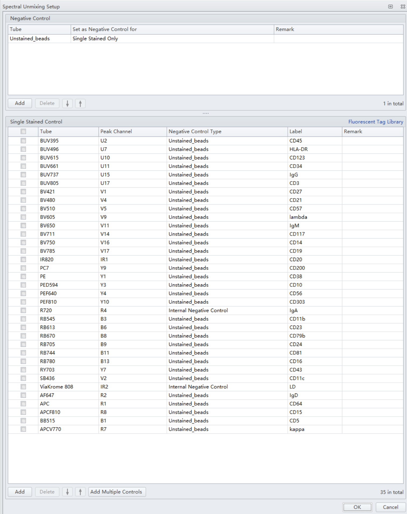
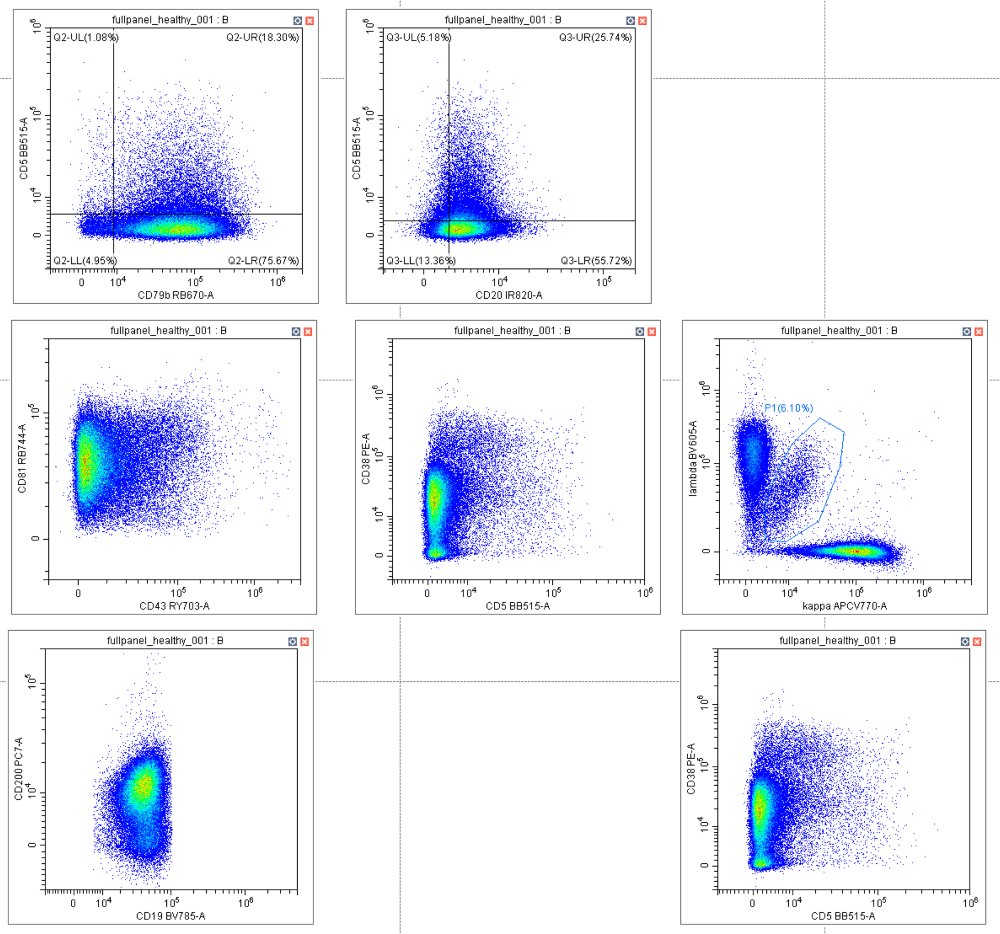
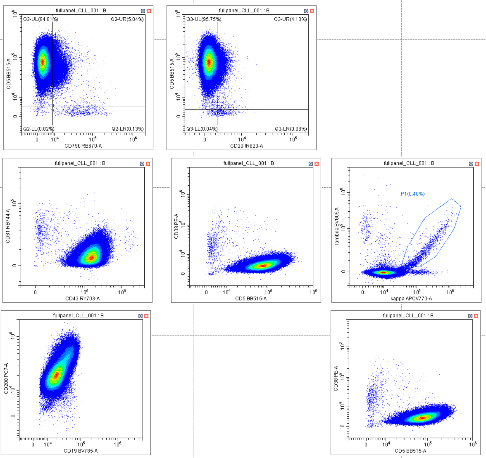

```{=html}
<style type="text/css">
.main-container {
  max-width: 85% !important;
  margin: auto;
}
</style>
```

# Summary

Iteration 4 of B cell plus myeloid panel. This report contains descriptions of human samples used, panel information, staining protocol, instrument and acquisition settings, and the generated .fcs files. The 'Spectral Unmixing' section outlines the workflow for optmiziation of unmixing. To evaluate spectral unmixing, Iterations of unmixing matrices were applied to single stained cell controls and healthy and disease samples. Once the Unmixing is finalized, there will be an analysis section for full stain and mini-panels. An OMIP section was created to house data we need for the OMIP.

# Materials and Methods {.tabset}

## **PBMCs**

|  |  |
|-------------------------|:-----------------------------------------------|
| **Healthy PBMC** | Flow core's stock of cryospreserved PBMC from a single donor. Ficoll separated, stored at -80C in FBS +10% DMSO |
| **CLL PBMC** | Frozen CLL PBMC provided by Beckman (tube 1/2 from one of two donor samples) |

## **Panel Info**

|  |  |  |  |  |  |  |  |  |  |
|:-------|:-------|:------:|:------:|:------:|:------:|:------:|:------:|:------:|:------:|
| **Dye** | **Marker** | **FMM1** | **FMM2** | **FMM3** | **FMM4** | **B cell only** | **NK, Baso, DC, Mono** | **FULL** | **Amount (uL) per 100 uL** |
| **BUV395** | **CD45** | CD45 | CD45 | CD45 | CD45 | CD45 | CD45 | CD45 | 2 |
| **BUV496** | **HLA-DR** | HLA-DR | X | HLA-DR | HLA-DR | HLA-DR | HLA-DR | HLA-DR | 1 |
| **BUV615** | **CD123** | CD123 | CD123 | CD123 | CD123 | X | CD123 | CD123 | 1.25 |
| **BUV661** | **CD34** | X | CD34 | CD34 | CD34 | CD34 | CD34 | CD34 | 2.5 |
| **BUV737** | **IgG** | IgG | X | IgG | IgG | IgG | X | IgG | 2.5 |
| **BUV805** | **CD3** | CD3 | CD3 | CD3 | CD3 | CD3 | CD3 | CD3 | 1.25 |
| **BV421** | **CD27** | CD27 | X | CD27 | CD27 | CD27 | X | CD27 | 1.25 |
| **SB436** | **CD11c** | X | CD11c | CD11c | CD11c | CD11c | CD11c | CD11c | 2.5 |
| **BV480** | **CD21** | CD21 | CD21 | CD21 | X | CD21 | X | CD21 | 1.25 |
| **BV510** | **CD57** | CD57 | CD57 | CD57 | CD57 | X | CD57 | CD57 | 1.25 |
| **BV605** | **Lambda** | Lambda | Lambda | X | Lambda | Lambda | X | Lambda | 5 |
| **BV650** | **IgM** | IgM | IgM | IgM | X | IgM | X | IgM | 2.5 |
| **BV711** | **CD117** | X | CD117 | CD117 | CD117 | X | CD117 | CD117 | 5 |
| **BV750** | **CD14** | CD14 | CD14 | CD14 | CD14 | CD14 | CD14 | CD14 | 2.5 |
| **BV785** | **CD19** | CD19 | CD19 | CD19 | CD19 | CD19 | CD19 | CD19 | 1 |
| **BB515** | **CD5** | CD5 | CD5 | X | CD5 | CD5 | X | CD5 | 2.5 |
| **RB545** | **CD11b** | CD11b | CD11b | CD11b | X | X | CD11b | CD11b | 1.25 |
| **RB613** | **CD23** | X | CD23 | CD23 | CD23 | CD23 | X | CD23 | 1.25 |
| **RB670** | **CD79b** | CD79b | CD79b | CD79b | X | X | X | CD79b | 1.25 |
| **RB705** | **CD24** | CD24 | CD24 | X | CD24 | CD24 | X | CD24 | 1.25 |
| **RB744** | **CD81** | CD81 | CD81 | CD81 | X | X | X | CD81 | 2.5 |
| **RB780** | **CD16** | CD16 | CD16 | CD16 | CD16 | X | CD16 | CD16 | 1.25 |
| **PE** | **CD38** | CD38 | CD38 | X | CD38 | CD38 | X | CD38 | 2.5 |
| **PEDZL594** | **CD10** | CD10 | CD10 | CD10 | X | CD10 | X | CD10 | 2.5 |
| **PE-F640** | **CD56** | X | CD56 | CD56 | CD56 | CD56 | CD56 | CD56 | 1.25 |
| **RY703** | **CD43** | X | CD43 | CD43 | CD43 | X | X | CD43 | 1.25 |
| **PE-Cy7** | **CD200** | CD200 | X | CD200 | CD200 | CD200 | X | CD200 | 1 |
| **PE-F810** | **CD303** | CD303 | CD303 | CD303 | X | CD303 | CD303 | CD303 | 2.5 |
| **APC** | **CD64** | X | CD64 | CD64 | CD64 | CD64 | CD64 | CD64 | 2.5 |
| **AF647** | **IgD** | IgD | X | IgD | IgD | IgD | X | IgD | 1 |
| **R720** | **IgA** | IgA | IgA | X | IgA | IgA | X | IgA | 2.5 |
| **APC-Vio770** | **kappa** | kappa | kappa | kappa | X | kappa | X | kappa | 5 |
| **APC-F810** | **CD15** | CD15 | CD15 | X | CD15 | X | CD15 | CD15 | 2.5 |
| **IR-820** | **CD20** | X | CD20 | CD20 | CD20 | CD20 | X | CD20 | 2.5 |
| **VK808** | **VK808** | VK808 | VK808 | VK808 | VK808 | VK808 | VK808 | VK808 | 0.25 |

## **Controls**

-   Controls were run on VersaComp beads and healthy PBMCs
-   All single-color controls were stained in standard 96-well round bottom plates
-   Heat killed PBMC were used as a control for Viakrome808 viability dye
-   Unstained controls were collected for beads, healthy, and CLL

## **Prepared Reagents**

-   PBMC thaw media (RPMI 1640 + 10% FBS)
-   Staining buffer (PBS + 0.5% BSA)
-   Premixes of:
    -   Viakrome808 in PBS (1:400)
    -   FMMs, mini-panels, and full panel diluted in staining buffer + BV Buffer (1:20)
    -   Human Fc (1:20) + monocyte block (1:20) in staining buffer

## **Staining Procedure**

**Thawing PBMCs**

PBMC vials were placed in a 37C water bath until a samll ice crystal remained and PBMCs were transferred to 10 mL of thaw medium, spun at 400 x g for 10 minutes, and washed 1X before counting.

**Blocking and Staining**

PBMCs were pre-blocked in Human Fc and monocyte block (1:20) for 15 minutes and aliquoted to 5mL FACS tubes or 96-well plates for staining. Cells were resuspended 100 uL Viakrome808 and stained for 15 minutes at RT in the dark and washed 2X. Samples for panel staining were resuspended in 50uL of IgG mix for 15 minutes before adding 100 uL of 1.5X Ab cocktail. For bead controls, 1 drop of Versacomp beads + 1.5 uL of Ab-fluor conjugate was added to wells of a 96-well plate. For cell controls, 45uL of staining buffer + appropriate volume of Ab-fluor conjugate added to wells followed by 50uL of cell suspension adjusted to to 5e6 cells/mL. Samples and controls were stained for 30 minutes at RT and washed 3X before acquisition.

## **Instrument QC and Settings**

**Instrument QC**

Instrument was QCd on the day of acquistion (7/22/25) but did not pass for all detectors. The instrument passed QC the day it was serviced by Nelson on on 7/11/25.

**Instrument and Acquisition Settings**

-   Control and sample data were recorded in three experiment files
-   Assay gain settings were applied to all tubes/wells
-   all samples run at medium medium flow rate

# FCS Files

## Raw FCS Files

### FMMs + MiniPanels

[Link to raw FCS files: FMMSs, mini-panels, fullstains](https://app.box.com/folder/333246779155)

| **sample \#** | **filename**              |
|:--------------|:--------------------------|
| 1             | FMM1_healthy_raw.fcs      |
| 2             | FMM2_healthy_raw.fcs      |
| 3             | FMM3_healthy_raw.fcs      |
| 4             | FMM4_healthy_raw.fcs      |
| 5             | Bcellonly_healthy_raw.fcs |
| 6             | NKBDCM_healthy_raw.fcs    |
| 7             | fullpanel_healthy_raw.fcs |
| 8             | Bcellonly_CLL_raw.fcs     |
| 9             | NKBDCM_CLL_raw.fcs        |
| 10            | fullpanel_CLL_raw.fcs     |
| 11            | US_healthy_raw.fcs        |
| 12            | US_CLL_raw.fcs            |

### Single-color controls
If a bead control filename contains _new, it means I reran this control at a later time. If a filename contains _cleaned, it is a cleaned control file and contains a subset of events from the original control file. 

[Link to raw single-color control files](https://app.box.com/folder/333247847268)

# Spectral Unmixing

-   Raw single-color control .fcs files were loaded into spectral unmixing experiments to generate spectral unmixing matrices, matrix iterations are numbered 001-00X. 

Matrices were applied to single stained cell files for each fluor in the panel. For every single stain, I generated 1 × N plots, where the primary fluor for a given single stain was plotted against all other unmixed parameters. I initially compared bead-only vs. cell-only matrices to determine which controls, cell or bead, provided optimal unmixing with minimal artifacts. From there, a hybrid matrix was constructed 1 x Ns were re-evaluated.

I created a FlowJo layout that allows me to see all 1 x Ns for a given unmixed single stain file.
I made a new layout for each matrix iteration - spread, potential errors, and improvements from previous iteration were flagged.

red = bad
green = good
yellow = better but not great

## Matrix #001 - Beads-only ugly
First unmixing attempt.

All spectral controls are beads except for Viakrome808 (viability) and R720-IgA (very few positive events possibly due to this clone not binding to beads)

A complete copy of the unmixing experiment (.xitsp file + .fcs file directory with control files can be found [here](https://app.box.com/folder/334368687874))

### Unmixed .fcs files

[FCS files: Unmixed FMMS, mini-panels, full stains, unstained for healthy and CLL](https://app.box.com/folder/333247578556)

### Spectral Unmixing Setup

{width="800"}

### SSM

[Spectral Unmixing Details for 001](https://app.box.com/file/1938190300586)

### Unmixing results: unmixed controls

[PDFs of all unmixed controls for matrix 001](https://app.box.com/folder/333222412731)

### 1 x Ns 

[PDFs of single stained cell control 1xNs unmixed with matrix 001](https://app.box.com/folder/333241328640)

### CLL Markers on B cells

Took a peek at CLL markers on B cells

[link to pdfs of CLL markers gated on CD19+](https://app.box.com/folder/333471148033)

[plots recreated from this paper](https://pmc.ncbi.nlm.nih.gov/articles/PMC8276061/)





## Matrix #002 - Beads-only cleaned

Cleaned beads-only matrix (except viakrome80 8-viability and R720-IgA). 

If contaminating events were present in the original bead file and I was unable to make them go away, 'Ghost events'--spectral ribbon outliers that dont track with primary fluor-- were cleaned from the control files in a separate experiment by gating on scatter and time and imported back into the main unmixing experiment.These files have '_cleaned' in the file name

[Link to the cloned unmixing experiment with spectral unmixing details PDF](https://app.box.com/folder/335882732501)

## Matrix #003 - Cells-only w/ AF

003 is entirely cell controls. 

Note: In first version of this matrix, I noticed separate, distinct, AF-driven populations appearing positive in the UV channels in unmixed unstained cells. I went back and added an AF parameter (unstained_2) by gating on monocytes and assigning U7 as the primary detector. Unstained_cells, the main negative control, was assigned B3 and gated on small lymphocytes, and was insufficient to unmix the AF I was seeing in the 1 x Ns. Unstained_1 and unstained_2 have similar but different signatures. The false positives went away after that. 

note: 

BV711 - CD117 - rare
CD303- CDF34 - rare
CD10 - rare
SB436 - Cd11c - rare
BUV661 - CD34 - rarish

## Matrix #004 - Cell-Bead Hybrid

First iteration of a hybrid matrix starting with beads only (002), adding same AF controls as #003, and building from there. 

This approach favors beads, but if a fluor was unmixed better with cells in 003, I replaced the bead file with the cell file.

Current status:
I am going through 1 x Ns one by and one and tracking whether the unmixing looks the same or better after replacing with cells. 

v1:
all beads (except viakrome and R720) and monocyte AF

v2:
BUV496 - improved after replacing with cells

v3:
BV421 - improved after replacing with cells

v4:
BV510 - improved after replacing with cells (brighter on cells) 

v5: 
BUV661 - CD34, errors in APC-CD64 and AF647-IgD channels, try w/cells - cells didnt make those errors go away.

BV605-lambda - note: in unmixed singles when gating on monocytes, a BV605+ population nucleates around 10e4. In lymphocytes, lambda expression is continuous but is brightest < 10e5. lambda should not be expressed in monocytes. try putting on cells instead of beads
    
# OMIP {.tabset}

Place to store data we need for OMIP

## FMOs

## Titrations

## Matrices

spillover spreading, similarity, total spillover, Hotspot (what ever you have)

## Spectral Overlays

Snapshots of spectral overlays

## UMAP/Visne Healthy vs. Disease

UMAP/Visne etc between healthy and disease

## Table of Markers

Table of markers, clone, vendor, catalog number and purpose in the panel

## Resolution overlays

stacked histograms of single color biological control, FMO/FMM of that marker, Mini-panel and fully stained

## MiFlow Checklist
